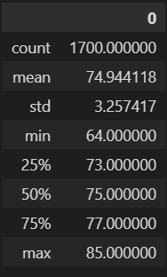

# Surfs Up - Module 9

## Overview - Explain the purpose of this analysis.
W. Avy, a perspective business owner in Oahu, Hawaii, has reached out for help to determine if opening a combination surf and ice cream shop would work year round in Hawaii. In ourder to determing this, we will look at the weather data for the last several years in Oahu during the months of June and December. This gives an idea of the weather in both the summer and winter to help decide the tourist draw that the island recieves during the winter months. 

## Results - Provide a bulleted list with three major points from the two analysis deliverables. Use images as support where needed.
### 3 Key Differences between June and December

	

- The weather in December is roughly 4 degress cooler than in June. 
    - The average tempes for December (71.04°F) and June (74.94°f) 

-

-

## Sumarry - Provide a high-level summary of the results and two additional queries that you would perform to gather more weather data for June and December.
