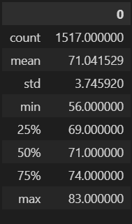

# Surfs Up - Module 9

## Overview
W. Avy, a perspective business owner in Oahu, Hawaii, has reached out for help to determine if opening a combination surf and ice cream shop would work year round in Hawaii. In ourder to determing this, we will look at the weather data for the last several years in Oahu during the months of June and December. This gives an idea of the weather in both the summer and winter to help decide the tourist draw that the island recieves during the winter months. 

## Results

June Weather Summary (left) | December Weather Summary (right)

   

- The weather in December is roughly 4 degress cooler than in June. 
    - The average tempes for December (71.04°F) and June (74.94°f) 

- The minimum temperature in June is 8°F warmer than in December.
    - The minimum temps in December (56°F) and June (64°F)

- The maximum temperature in June is only 2°F warmer than in December.
    - The maximum temps in December (83°F) and June (85°F)

Overall the weather in December is not that much different than it is in June. The biggest difference in December will be cooler temerpatures in the evenings and overnight. The high temperatures during the day are very similar. Because of the similar high temps all year round, it is safe to say that a combination surf and ice cream shop in Oahu would be a great business to open and would be busy year round. 

## Sumarry

The weather throughout the year is pretty constant in Hawaii. This is due to the location of Hawaii in the middle of the ocean and it's location closer to the equator. With this location in the Pacific Ocean it would also be advantageous to look at the amount of rain that Hawaii receives during these months and the temepartures of the stations at or near sea level versus the tempearture of stations at higher levels. 

To find the precipitation for June, run the following code below. 

    'precip = session.query(Measurement.date, Measurement.prcp).filter(extract('month', Measurement.date)==6).all()'

    'precip_df = pd.DataFrame(precip)'

    'precip_df.describe()'
    
The code above would find the precipitation in June. To find the precipitation for December, change the ==6 to ==12 at the end of the code. This also places the list of preciptiation values into a dataframe and produces some summary statistics about the data. 

To find the temperature at locations closer to sea level for these months, run the following code. 

    'sea_temp = session.query(Measurement.date, Measurement.tobs, Station.elevation).filter(extract('month', Measurement.date)==6).filter(extract('month', Station.elevation) <= 1000).all()'

    'sea_temp_df = pd.DataFrame(sea_temp)'
    
    'sea_temp_dr.describe()'
    
This code will find the temperature for stations at elevations less than 1000ft. Elevations higher than this will skew the temp data and will not be necessary for a store trying open on the ocean at sea level. It will also skew the data colder than sea level. 

